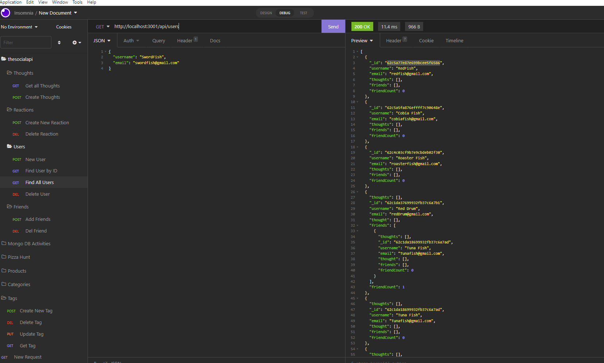

# The Social API
NoSQL Challenge: Social Network API
---
## About

Build an API for a social network web application where users can share their thoughts, react to friends’ thoughts, and create a friend list. You’ll use Express.js for routing, a MongoDB database, and the Mongoose ODM. In addition to using the Express.js (Links to an external site.) and Mongoose (Links to an external site.) packages, you may also optionally use a JavaScript date library of your choice or the native JavaScript Date object to format timestamps.

---

### User Story
```
AS A social media startup
I WANT an API for my social network that uses a NoSQL database
SO THAT my website can handle large amounts of unstructured data
```
---

### Criteria
```
GIVEN a social network API
WHEN I enter the command to invoke the application
THEN my server is started and the Mongoose models are synced to the MongoDB database
WHEN I open API GET routes in Insomnia for users and thoughts
THEN the data for each of these routes is displayed in a formatted JSON
WHEN I test API POST, PUT, and DELETE routes in Insomnia
THEN I am able to successfully create, update, and delete users and thoughts in my database
WHEN I test API POST and DELETE routes in Insomnia
THEN I am able to successfully create and delete reactions to thoughts and add and remove friends to a user’s friend list
```
---

## Mock Up


---

### Installation
[REPO](https://github.com/lawalker4/thesocialapi/tree/develop)

[Express.js](https://expressjs.com/en/starter/installing.html)

[MySQL](https://www.mysql.com/)

[Insomnia](https://insomnia.rest/)

---

### Usage

To run application take the following steps:

-Clone repo to your computer.
-Open terminal and run npm i
-Run npm start
-Open new live server and type in localhost:3001 in Insomnia
-Go through the different folders and to run Put, Post and Delete option

---

### Screenshot

:movie_camera:	
[Demo Video](https://watch.screencastify.com/v/f0fMNBujNjH6RzRUygL4)



---

#### Author

:black_nib:	Built and maintain by [Ashley Walker](https://github.com/lawalker4)

---

#### Contact me with any questions you might have
:mailbox_with_mail:
Email: lauraashleywalker4@gmail.com